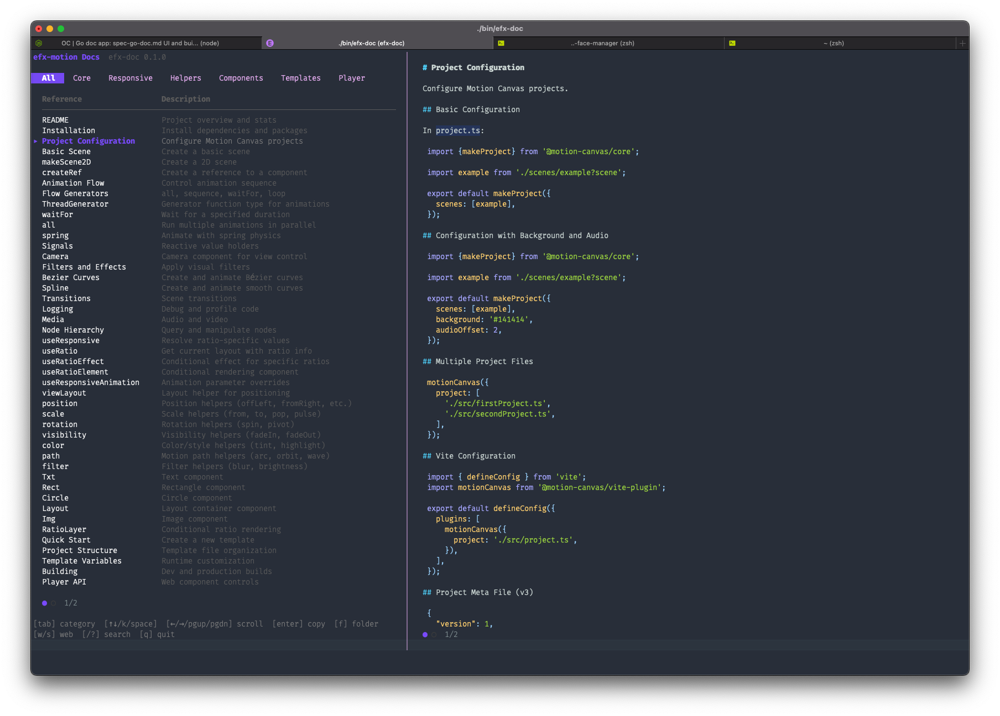
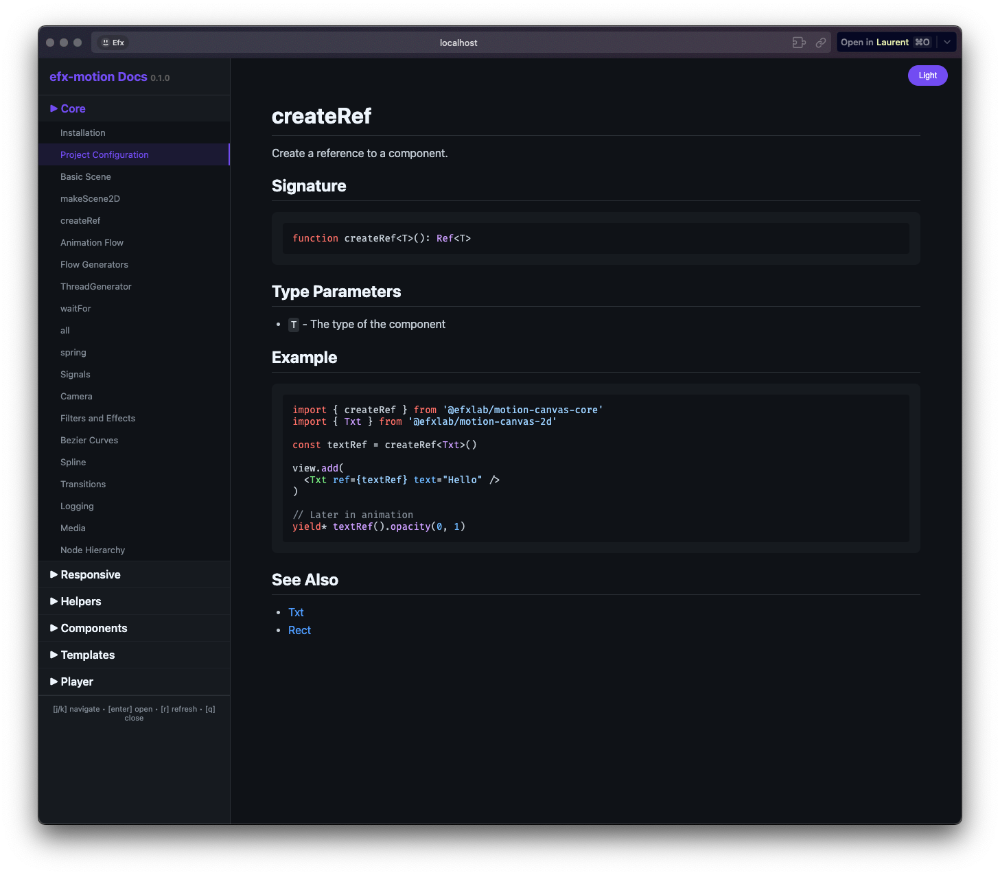

# efx-doc

A **TUI + Web** documentation viewer that renders markdown in real-time. Built with Go, Bubble Tea and Glamour.


## Features

- 📺 **Dual Preview**: View documentation in **Terminal (TUI)** or **Browser (Web)**
- 🎨 **Live Rendering**: Markdown is converted to HTML on-the-fly via local HTTP server
- 📚 **Two-column layout (TUI)**: Navigation on the left, markdown preview on the right
- 🌐 **Web Preview**: Opens in browser with syntax highlighting and light/dark theme toggle
- 🔍 **Full-text search**: Search across all documentation
- 📱 **Responsive**: Adapts to terminal size
- 📋 **Clipboard**: Copy documentation with `[Enter]` key
- ⌨️ **Full keyboard navigation**

## Screenshots

### TUI Preview


### Web Preview


## Quick Start

```bash
# Build
make build

# Run - select a workspace to view docs
./bin/efx-doc
```

Press `w` to open the web preview in your browser!

## Installation

### From Release

Download the latest release for your platform:

```bash
# macOS
curl -L https://github.com/efxlab/efx-doc/releases/latest/download/efx-doc-darwin-arm64 -o efx-doc
chmod +x efx-doc

# Linux
curl -L https://github.com/efxlab/efx-doc/releases/latest/download/efx-doc-linux-amd64 -o efx-doc
chmod +x efx-doc

# Windows
curl -L https://github.com/efxlab/efx-doc/releases/latest/download/efx-doc-windows-amd64.exe -o efx-doc.exe
```

### From Source

```bash
git clone https://github.com/efxlab/efx-doc.git
cd efx-doc
make build
```

## Usage

```bash
# Run the application
./efx-doc

# Or install to PATH
make install
```

## Keyboard Shortcuts

| Key | Action |
|-----|--------|
| `↑/↓` or `j/k` | Navigate document list |
| `Space` | Next document |
| `Tab` | Switch category |
| `←/→` | Previous/Next page (list) |
| `PgUp/PgDn` | Scroll documentation |
| `/` or `?` | Search |
| `Enter` | Copy to clipboard |
| `f` | Open folder in Finder |
| `w` | 🌐 **Open web preview** |
| `s` | Stop web server |
| `q` | Quit |

## 🌐 Web Preview (Key: `w`)

This is the **main feature** of efx-doc! Press `w` to start a local HTTP server and open documentation in your browser:

- **Live conversion**: Markdown → HTML in real-time
- **Sidebar navigation**: Browse categories and documents
- **Syntax highlighting**: Code blocks with GitHub Dark/Light themes
- **Light/Dark mode**: Toggle button in top-right corner
- **Keyboard navigation**: `j/k` navigate, `Enter` open, `r` refresh
- **Auto-sync**: Changes in TUI reflect instantly in browser

## Configuration

The application uses workspace configuration to load documentation. Workspaces are defined in `~/.config/efx-doc/workspaces.yaml`.

### Adding Documentation

See [BUILDING.md](BUILDING.md) for detailed instructions on creating documentation for efx-doc.

## Development

```bash
# Build for current platform
make build

# Build for all platforms
make build-all

# Run in development mode
make dev

# Run tests
make test
```

## License

MIT License - see [LICENSE](LICENSE) for details.

---

Built with ❤️ using [Bubble Tea](https://github.com/charmbracelet/bubbletea) and [Glamour](https://github.com/charmbracelet/glamour)
